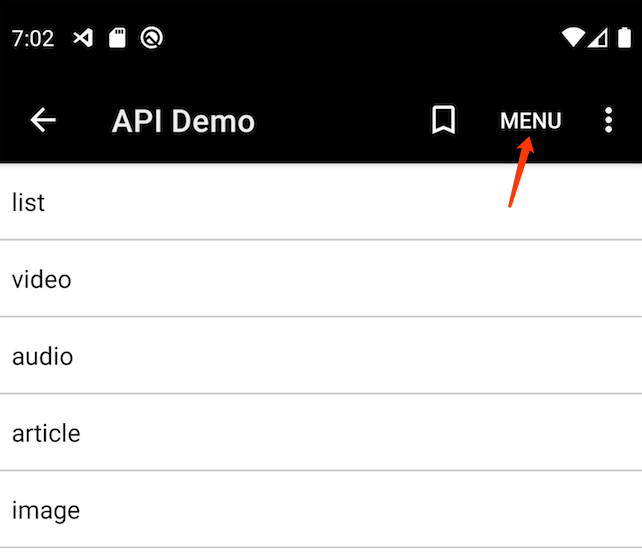

# 组件(component)基础

每个组件(component) 对应的是一个原生页面，每打开一个新页面时就会创建一个新的组件，当页面销毁时，相应的组件实例也会被销毁。
每个组件文件需要通过 `module.exports` 指定一个 `object`。

例如 ：
```javascript
module.exports = {
    type: 'list'
    async fetch({ page }) {
        val resp = await http.get('http://api.example.com/')
        val videos = ... // process network response
        return {
            nextPage: page + 1,
            items: videos
        }
    }
}
```
> [!TIP]
> 在点击一个扩展图标时，Dora.js 首先启动的是 `index` 组件，对应的是 components/index.js 这个文件

<!-- 
> [!TIP]
> 下面的“自动继承”的意思是这些属性值可以从点击时的列表条目属性继承下来，比如你是从一个 `title` 为 'Hello World' 的列表条目点击进入这个组件的，那么这个组件的 `title` 在初始化时候就会设置为 'Hello World'。"n/a" 表示列表条目没有这个属性，无法继承。 -->

所有组件都支持设置以下属性：
 - `const type: string` 组件类型([详情](#type))，常量，运行时无法修改
 - `id: string` 资源标识，用于区分不同的资源、保存进度等
 - `title: string` 页面标题
 - `subtitle: string|null` 页面子标题
 - `actions: Action[]` 当前页面的自定义菜单项([详情](#actions-action))
 - `author: Author` 作者信息([详情](api/struct#author))
 - `summary: string` 概要描述
 - `thumb: Url|null` 缩略图/图标([详情](api/struct#url))
 - `error: string|null` 当前遇到的错误消息([详情](#error-stringnull))
 - `searchRoute: Route|null` 搜索的路由([详情](#searchroute-route))
 - `fetch(context: object): object` 获取组件数据([详情](#fetchcontext-object-object))
 
Dora.js 所有组件都提供以下接口：
  - `const route: Route` 当前组件的路由
  - `const args: object` 当前组件的路由参数，`route.args` 的 alias (别名)，方便访问
  - `from: Route|null`: 当前组件的来源路由, 如果是首页，则 from 会为 `null`
  - `refresh()` 刷新当前页面，重新加载组件数据
  - `finish()` 结束当前组件页面

## type

通过 `type` 指定组件的类型后，会加载相应类型的 API，扩充组件实例化对象的成员。
```javascript
module.exports = {
    type: 'video'
}
```
Dora.js 支持以下类型的组件：
 - [list](/component/list): 目录组件，适合展示列表类的数据
 - [video](/component/video): 视频播放器组件
 - [audio](/component/audio): 音频播放器组件
 - [article](/component/article): 文章查看组件
 - [image](/component/image): 图片查看组件
 - [browser](/component/browser): 浏览器组件
 - [topTab](/component/browser): 顶部 tab 布局 组件
 - [bottomTab](/component/browser): 底部 tab 布局组件
 - [drawer](/component/browser): 抽屉菜单布局组件
 - __book__: 图书查看组件 **❌暂未完善**
 - __cartoon__: 漫画查看组件 **❌暂未完善**
 - __compose__: 编辑器组件 **❌暂未完善**


## fetch(context: object): object

`fetch()` 方法接受一个 `context` 的参数，可以利用它来获取一些参数，它拥有以下属性：
 - `from: Route`: 来源的路由
 - `route: Route`: 当前组件的路由
 - `args: object`: `route.args` 的别名，为了便于获得路由的参数
 - `page: any?`: 分页加载时用到的分页信息（目前只有 `list` 类型的组件才会有这个值）
```javascript
module.exports = {
    async fetch(context) {
        console.log(context.args)
        console.log(context.route)
        console.log(context.from)
        // ...
    }
}
```
> [!TIP]
> 为了方便我们可以利用 JavaScript 的 [解构赋值](https://developer.mozilla.org/zh-CN/docs/Web/JavaScript/Reference/Operators/Destructuring_assignment#%E8%A7%A3%E6%9E%84%E5%AF%B9%E8%B1%A1) 来更方便的得到所需的参数:
> ```javascript
> module.exports = {
>    async fetch({ page, args }) {
>        // ...
>    }
> }
>```

`fetch()` 返回一个 object，之后 Dora.js 会把这个 object 的属性值赋值给组件的相应成员属性。

```javascript
module.exports = {
    async fetch({ args }) {
        let resp = await $http.get(`http://api.example.com/user/${args.uid}`)
        return {
            title: '', // 等同于 this.title = ''
            subtitle: '', // 等同于 this.subtitle = ''
            actions: [], // 等同于 this.actions = []
            // ...
        }
    }
}
```
Dora.js 允许你使用不同的方式来返回数据：
 - 直接返回数据，适合一些静态数据

```javascript
module.exports = {
    style: 'bottom_tab',
    fetch (conetxt) {
        return [{
            title: '推荐',
            route: $route('recommend')
        }]
    }
}
```
 - 返回一个 `Promise`
```javascript
module.exports = {
    fetch (conetxt) {
        return $http.get(`https://api.example.com/posts/${this.args.id}`)
        .then((res) => {
            return { url: res.data.url }
        })
    }
}
```

 - 👍使用 `await/async` ([学习一下](https://javascript.info/async-await))
```javascript
module.exports = {
    async fetch (conetxt) {
        let res = await $http.get(`https://my-api/posts/${this.args.id}`)
        return { url: res.data.url }
    }
}
```

## id: string

默认值：`this.route.args.toString()`

Dora.js 使用 `id` 来作为资源的唯一标识，唯一性仅局限于当前组件内（Dora.js 底层会把 `this.route.path` + `this.id` 作为唯一标识）
唯一标识可用于收藏、进度恢复等场景，Dora.js 默认会把 `route.args` 转化成字符串赋值给 `id`

## actions: Action[]

是一个 [Action](api/struct#action) 数组，设置后会在界面顶部显示菜单项



## error: string|null

如果出现加载错误，可自定义显示错误的消息，否则 Dora.js 会把 Error 的 message 作为错误信息展示。刷新操作会把 `error` 置为 `null`，当为 `null` 时，错误提示会被清空。

## searchRoute: Route?

默认值：`$dora.defaultSearchRoute`

如果 `searchRoute` 不为 `null`，页面会显示一个搜索按钮
当用户搜索时，会将输入的关键字作为 `args` 的 `keyword` 属性 传入以下参数到目标路由。

目标路由获取搜索关键字：
```javascript
module.exports= {
  type: 'list',
  async fetch({ args }) {
      let keyword = args.keyword
      console.log(keyword)
  }
}
```